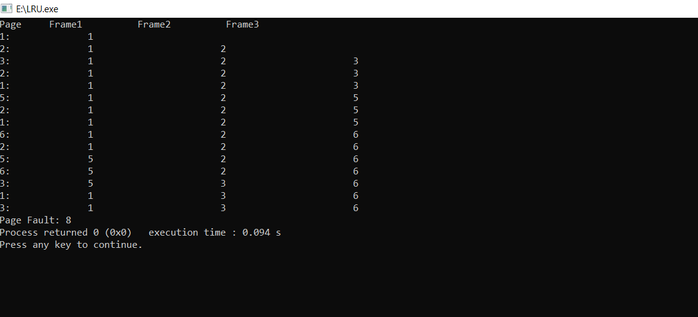

# LRU
<h2>LRU Page Replacement Algorithm Example</h2>
<h1>LRU Page Replacement Algorithm Example</h1>
<h2>Description</h2>
<h3>The LRU algorithm replaces the least recently used page when the page frame is full and a new page needs to be allocated. It aims to minimize page faults by keeping frequently used pages in memory.</h3>
<h2>Example Scenario</h2>
<table>
<caption>Page Reference Sequence and Frame State</caption>
<thead>
<tr>
<th>Page</th>
<th>Frame 1</th>
<th>Frame 2</th>
<th>Frame 3</th>
</tr>
</thead>
<tr>
<td>1:</td>
<td>1</td>
<td></td>
<td></td>
</tr>
<tr>
<td>2:</td>
<td>1</td>
<td>2</td>
<td></td>
</tr>
<tr>
<td>3:</td>
<td>1</td>
<td>2</td>
<td>3</td>
</tr>
<tr>
<td>2:</td>
<td>1</td>
<td>2</td>
<td>3</td>
</tr>
<tr>
<td>1:</td>
<td>1</td>
<td>2</td>
<td>3</td>
</tr>
<tr>
<td>5:</td>
<td>1</td>
<td>2</td>
<td>5</td>
</tr>
<tr>
<td>2:</td>
<td>1</td>
<td>2</td>
<td>5</td>
</tr>
<tr>
<td>1:</td>
<td>1</td>
<td>2</td>
<td>5</td>
</tr>
<tr>
<td>6:</td>
<td>1</td>
<td>2</td>
<td>6</td>
</tr>
<tr>
<td>2:</td>
<td>1</td>
<td>2</td>
<td>6</td>
</tr>
<tr>
<td>5:</td>
<td>5</td>
<td>2</td>
<td>6</td>
</tr>
<tr>
<td>6:</td>
<td>5</td>
<td>2</td>
<td>6</td>
</tr>
<tr>
<td>3:</td>
<td>5</td>
<td>3</td>
<td>6</td>
</tr>
<tr>
<td>1:</td>
<td>1</td>
<td>3</td>
<td>6</td>
</tr>
<tr>
<td>3:</td>
<td>1</td>
<td>3</td>
<td>6</td>
</tr>
</table>
<h3><strong>Total Page Faults:</strong> 8</h3>
<h2>Implementation:</h2>
<h4>The LRU algorithm is implemented in various systems to manage memory efficiently. It works on the principle of evicting the page that has not been accessed for the longest time when a new page needs to be loaded into memory.

<h3>Input and Output is given below </h3>

    
